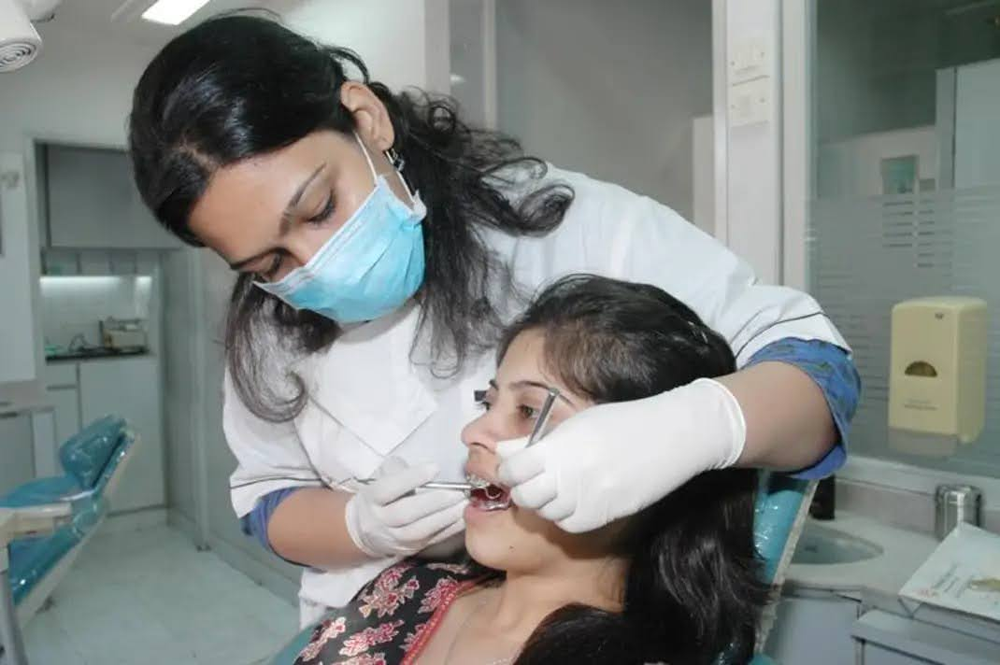
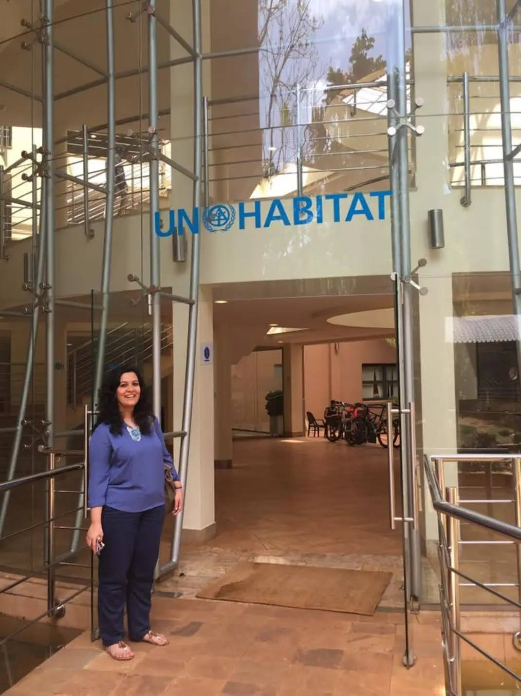
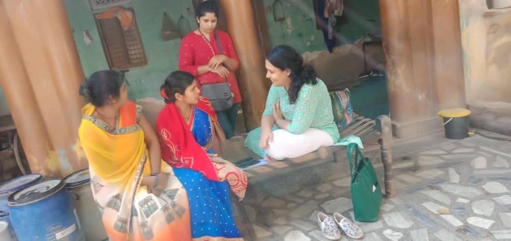
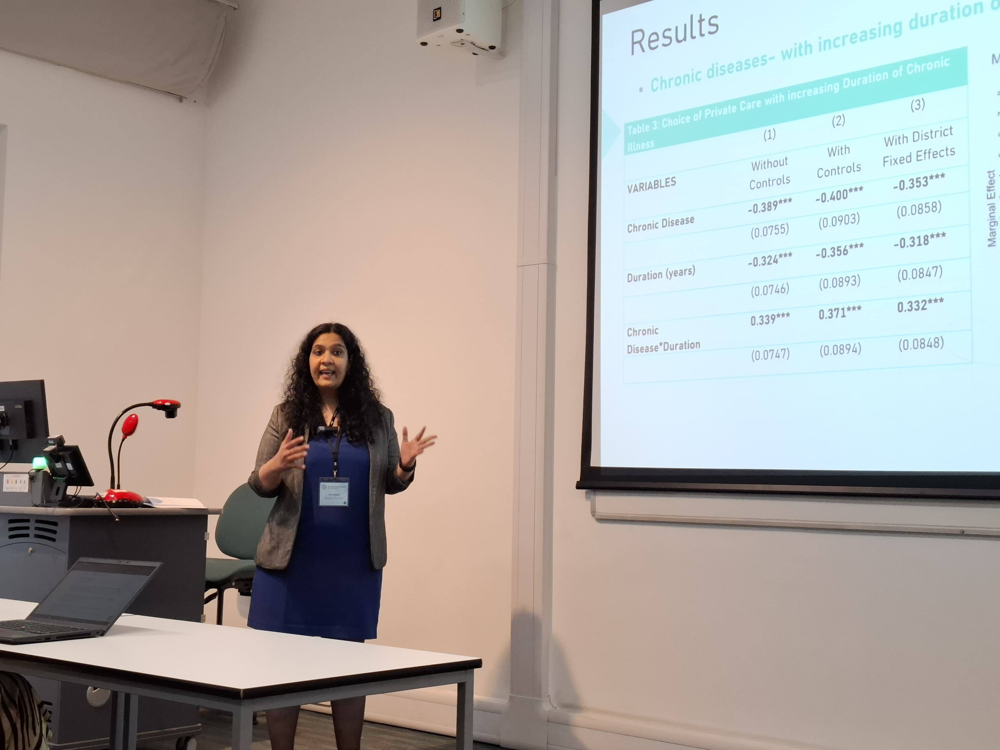

::: {layout-ncol=4 layout-align="center"}

{width=80%}

{width=45%}

{width=110%}

{width=75%}

:::

Welcome! I am a PhD Candidate in Politics and International Relations at University College Dublin, where my research sits at the intersection of public health, health systems, and public policy. My doctoral research examines universal health coverage (UHC) and access to care in India, with a particular focus on the populations that remain outside existing forms of financial protection, including the role of civil society organizations in UHC. 

I use mixed methods, combining quantitative analysis of large, nationally representative survey datasets with qualitative research through in-depth interviews and focus group discussions. More broadly, my research interests include health systems, health policy, health equity, civil society, health financing, and the design and implementation of public health programmes.

My research is informed by a professional background that spans clinical practice, civil society, public health research and implementation. Before my PhD, I trained and practiced as a dentist and subsequently worked as a public health professional across civil society organisations, foundations and professional associations. I have contributed to public health programmes in India and internationally. My work has covered areas spanning health systems strengthening, maternal and reproductive health, health financing, diagnostics, and implementation research.

My Doctoral research is supported by the University College Dublin, Department of Politics and International relations through the Iseult Honohan Doctoral Scholarship. I previously completed a Masters in Public Health (MPH) at the University of Leeds as a Joint Japan/World Bank Graduate Scholar, where I received the John Griffith Prize for overall distinction.

I am currently exploring postdoctoral, research, and academic opportunities that align with my broader interests in health systems, public health, policy, and applied research.

Please feel free to [contact me](mailto:parikh.neha@gmail.com) if you have any questions or would like to discuss potential opportunities.

