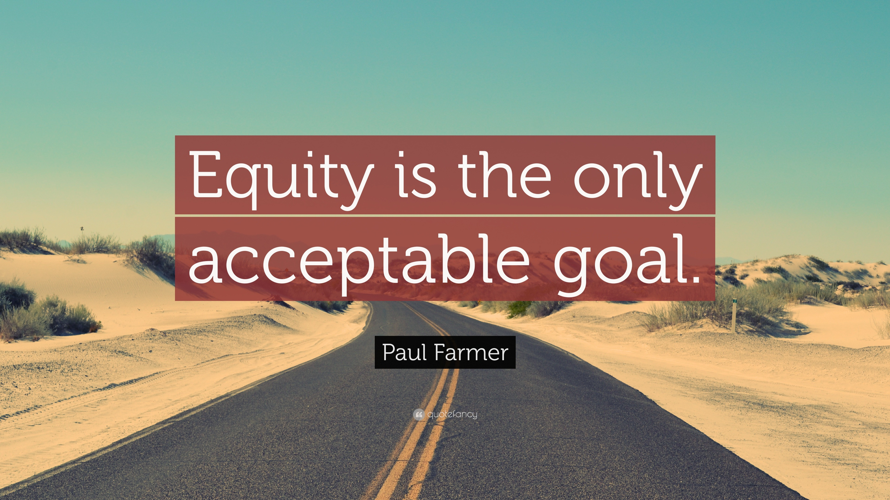
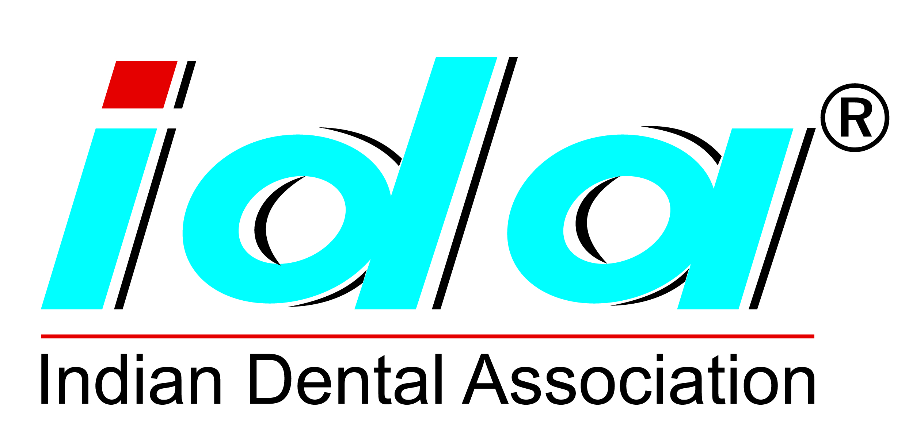

::: {layout-ncol=1 layout-align="center"}

My work in public health and development has spanned research, programme design, implementation, health systems strengthening, grant and stakeholder management, and capacity building. Before beginning my PhD, I worked across civil society and professional organisations in India, leading and supporting programmes in health systems, diagnostics, maternal and reproductive health, innovative financing, tobacco cessation, and urban development.

---

::: {.columns}

::: {.column width="70%"}

### Swasti Health Catalyst

**Portfolio Manager – Health Research | Technical Specialist, Health Practice**

:::

::: {.column width="30%"}

{width=200px fig-align="right"}

:::

:::

At [Swasti](https://swasti.org/), I led and supported a diverse portfolio of public health research and consulting assignments across health systems strengthening, health equity, diagnostics, RMNCH, family planning, innovative financing, COVID-19, and gender and social inclusion.

As Portfolio Manager for Health Research, I led a multidisciplinary research team and was responsible for developing the portfolio's research strategy, designing proposals and research frameworks, guiding data collection and analysis, generating learning, and strengthening research capacity within the organisation. I also represented research assignments and organisational learning through workshops, conferences, and other external forums.

My work involved managing projects from design through implementation, including technical oversight, stakeholder engagement, donor and grant management, and dissemination. I worked on programmes supported by organisations including the **Rockefeller Foundation**, **FIND Diagnostics**, **USAID**, and **MSD for Mothers**, and contributed to securing substantial follow-on funding for the organisation's public health work.

---

::: {.columns}

::: {.column width="70%"}

### Narotam Sekhsaria Foundation

**Senior Manager – Health, Youth & Urbanisation**

:::

::: {.column width="30%"}

{width=250px fig-align="right"}

:::

:::

At the [Narotam Sekhsaria Foundation](https://nsfoundation.co.in/), I managed portfolios spanning public health and urban development.

Within the health portfolio, I worked on the incubation and scale-up of tobacco cessation programmes, including strengthening the capacity of public health systems and healthcare institutions to deliver cessation services. I also conceptualised and co-created a patient-support platform designed to make information about healthcare services in Mumbai easier to access.

My work in youth and urbanisation included managing the India initiative of the **UN-Habitat Urban Youth Fund**. Through the programme, I supported and mentored young social entrepreneurs developing low-cost, youth-led solutions to challenges in health, gender, environment, governance, and urban systems.

---

::: {.columns}

::: {.column width="70%"}

### Indian Dental Association

**Senior Manager**

:::

::: {.column width="30%"}

{width=110px fig-align="right"}

:::

:::

At the [Indian Dental Association](https://ida.org.in/), I worked on the conceptualisation, development, and management of national public health initiatives focused on oral health and tobacco cessation.

I helped establish and manage the [National Oral Health Programme](http://nohp.org.in/#/Home), an initiative aimed at expanding awareness of oral health and strengthening preventive approaches, and the [Tobacco Intervention Initiative](http://tii.org.in/), which sought to integrate tobacco cessation into routine dental practice.

The role involved taking programmes from concept to implementation, working with health professionals and institutional partners, developing programme systems and resources, and supporting their delivery at scale. This period also marked my transition from clinical dentistry into public health and health programme management.

:::