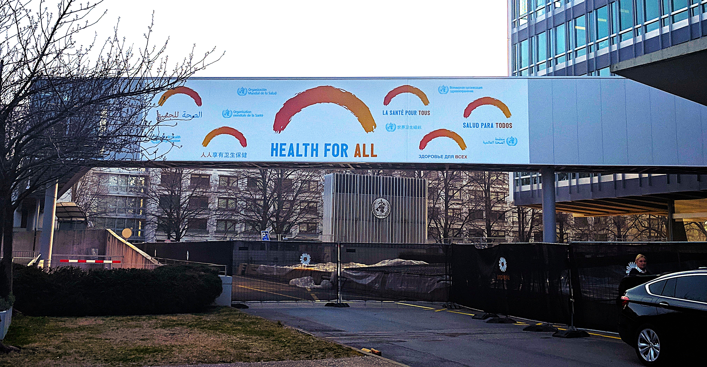

::: {layout-ncol=1 layout-align="center"}

### Academic

2025, School of Politics and International Relations (UCD), Research Committee Grant, **EUR 750**

---

2024, School of Politics and International Relations (UCD), Research Committee Grant, **EUR 750**

---

2023, UCD Iseult Honohan Doctoral Scholarship, **EUR 95,666**

---

2018, Joint Japan/World Bank Graduate Scholarship Program (JJ/WBGSP), University of Leeds, **GBP 32,100**

---

### Implementation Project Grants (Team based)

Feasibility and Acceptability of Workplace Peer-Assisted SARS-CoV-2 Self-Testing – FIND Diagnostics, Geneva, 2021-2022, Project Agreement Number: CV21 0183, **Project Grant: USD 200,235**  

*Role: Principal Investigator*

---

Protection of vulnerable communities (SARS-Cov-2)- Rockefeller Foundation, 2021-2023, Grant Number- 2021 ARO 001, **Project Grant: USD 7,50,000**

*Role: Principal Investigator*

---

Manyata for Mothers, Sustainability Architecture – Merck for Mothers, 2020-2022, Grant Number: MSD-Manyata-BM, **Project Grant: USD 230,228**

*Role: Technical Specialist*

---
:::