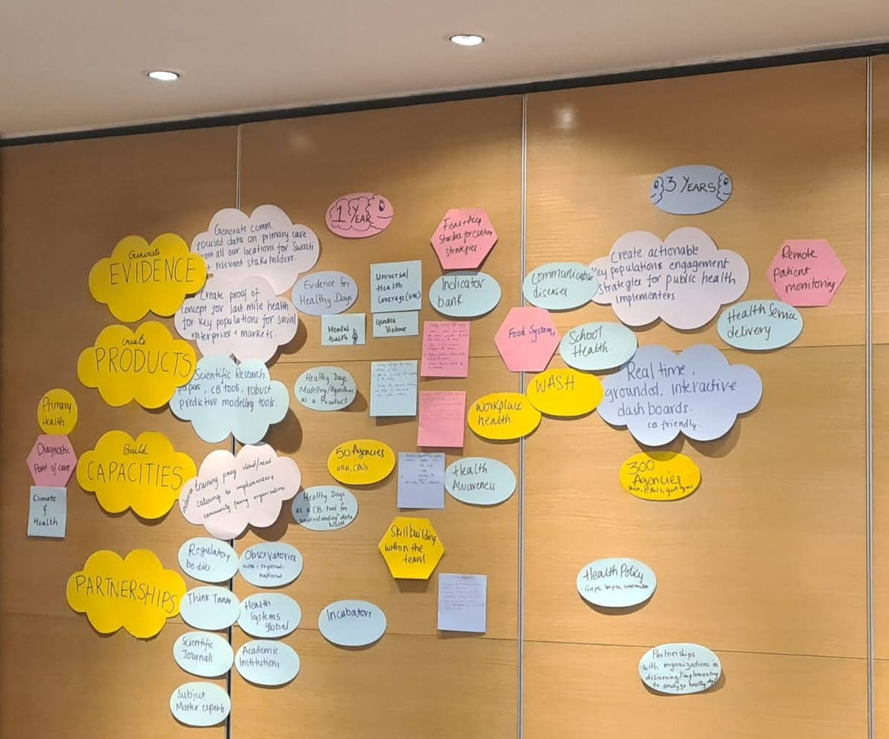

::: {layout-ncol=1 layout-align="center"}

### Journal Articles

**When Illness Becomes Debt: Catastrophic Health Expenditures and Financial Distress—Evidence From India's Healthcare System.**

**Parikh, N.**, and K. C. Vadlamannati. (2026). *World Medical & Health Policy* 18: e70090. 

[View article](https://onlinelibrary.wiley.com/doi/10.1002/wmh3.70090){target="_blank"}

---

**Usability of peer-assisted SARS-CoV-2 self-testing among factory workers in India**  
Pydi, M.R., **Parikh, N.**, Ranawat, P. *et al.* (2026). *Discover Public Health, 23*, 681.  

[View article](https://doi.org/10.1186/s12982-026-02024-8){target="_blank"}

---

**Diseases and Disparities: The Impact of COVID-19 Disruptions on Sexual and Reproductive Health Services Among the HIV Community in India**  
**Parikh, N.**, Chaudhuri, A., Syam, S.B. *et al.* (2022). *Archives of Sexual Behavior*. 

[View article](https://doi.org/10.1007/s10508-021-02211-5){target="_blank"}

---

**Fostering Resilient Health Systems in India: Providing Care for PLHIV Under the Shadow of COVID-19**  
**Parikh, N.**, Chaudhuri, A., Syam, S.B. and Singh, P. (2022). *Frontiers in Public Health*. 

[View article](https://doi.org/10.3389/fpubh.2022.836044){target="_blank"}

---

**Building health system resilience and pandemic preparedness using wastewater-based epidemiology from SARS-CoV-2 monitoring in Bengaluru, India**  
Chaudhuri, A., Pangaria, A., Sodhi, C., Kumar, V.N., Harshe, S., **Parikh, N.** and Shridhar, V. (2023). *Frontiers in Public Health*. 

[View article](https://doi.org/10.3389/fpubh.2023.1064793){target="_blank"}

---

### Conference Papers

**Assessment of the usability of SARS-CoV-2 self-tests in a peer-assisted model among factory workers in Bengaluru, India**  
Meghana Pydi, **Neha Parikh** (2023). *Population Medicine*. 

[View paper](https://doi.org/10.18332/popmed/164944){target="_blank"}

---

**Knowledge, attitudes, practices and perceptions around SARS-CoV rapid antigen self-tests among urban poor communities of Mohammadpur and Bangalore, India**  
**Neha Parikh**, Syama B. Syam, Ravneet Kaur, Angela Chaudhuri, Shankar A.G. (2023). *Population Medicine*.  

[View paper](https://doi.org/10.18332/popmed/165247){target="_blank"}

---

### Opinion & Commentary

**Sexual and Reproductive Health – The Situation for the ‘Hijras’**  
*USAID – Learning for Impact*  
**Neha Parikh**

[Read article](https://www.learning4impact.org/content/sexual-and-reproductive-health---the-situation-for-the-hijras--203){target="_blank"}

---

**The rights to SRHR, challenges, and possibilities during COVID**  
*Asia Pacific Alliance for Sexual and Reproductive Health and Rights*
Dr. Angela Chaudhuri (MPH), **Dr. Neha Parikh (MPH)**, Dr. Syama B Syam (MPH), Pratishtha Singh (MPH), Prachi Pal (MA), Dr. Praneeth Pillala (MBBS)

[Read article](https://www.asiapacificalliance.org/our-work/blog/rights-srhr-challenges-and-possibilities-during-covid){target="_blank"}

---

**Investing In Cancer Prevention -A Decade and Counting**  
*Adolescent Tobacco Use: A Need For Concern*  
**Dr Neha Parikh**

[Read article](https://nsfoundation.co.in/%7Estudiobh/nsfoundation/wp-content/uploads/2024/03/2.-NSF-Cancer-Monograph.pdf){target="_blank"}

---

### Media

**How self-regulation is paramount to an accountable private health sector in India**  
*The Times of India* (2022). 
**Dr. Neha Parikh** and Dr. Angela Chaudhuri

[Read article](https://timesofindia.indiatimes.com/blogs/voices/how-self-regulation-is-paramount-to-an-accountable-private-health-sector-in-india/){target="_blank"}

---

### Implementation Playbooks

**Self-Testing in Factories**  
A playbook for global pandemic preparedness, developed from a programme supported by FIND.  

[View playbook](https://playbooks.swasti.org/self-testing.html#page1){target="_blank"}

---

**Self-Testing in Communities**  
A playbook for global pandemic preparedness, developed from a programme supported by the Rockefeller Foundation. 

[View playbook](https://playbooks.swasti.org/self-testing-communities.html){target="_blank"}

:::