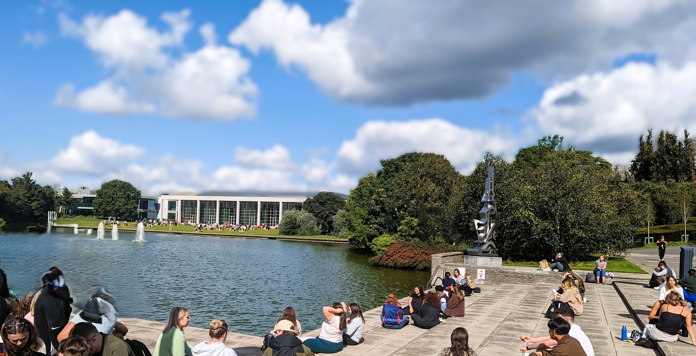

---
title: Teaching
---

::: {layout-ncol=1 layout-align="center"}

My teaching sits at the intersection of global health, politics, development, and research methods. At University College Dublin, I have taught across undergraduate and postgraduate modules in Politics and International Relations, Development Studies, and Health Systems.

A particular milestone in my teaching experience has been the opportunity to design and teach my own module, **Global Health, Politics and Development (POL36310)**. I was one of a small number of PhD candidates approved to develop and deliver an independent module within the School of Politics and International Relations.

---

**Global Health, Politics and Development (POL36310) | Occasional Lecturer**

I designed ***Global Health, Politics and Development*** to introduce students to global health as a political and development issue, rather than solely a medical or technical one.

The module examines how health outcomes; including maternal mortality, life expectancy, disease patterns, and access to healthcare are shaped by political institutions, governance arrangements, economic structures, and global inequalities. It asks students to consider how states, international organisations, donors, private actors, and civil society influence the priorities, financing, and delivery of global health policy.

Key themes include:

- Universal Health Coverage and health-system reform
- Global health financing and development assistance for health
- International organisations and global health governance
- Commercial determinants of health
- Ethics, human rights, and health inequality
- Decolonising global health
- The role of private actors and civil society in health policy
- Health and the Sustainable Development Goals
- Politics, power, and institutional reform

Throughout the module, health is used as a lens through which students can engage with wider questions of **governance, inequality, development, power, and international cooperation**.

My aim in designing the course has been to bring together academic debates with real-world public health and policy examples, drawing on my own background in health research, civil society, and programme implementation.

---

**Student Feedback**

*Student feedback from POL36310 will be added here.*

---

***Other Teaching Experience***

**Sustainable Development Goals (DEV20130) | Teaching Assistant **

Supported undergraduate teaching on the Sustainable Development Goals and their relationship to contemporary development challenges.

I also designed and delivered a lecture on **Data for Development** in both 2024 and 2025, introducing students to the role of data in measuring development, identifying inequalities, informing policy, and assessing progress towards the SDGs. *(Spring 2024 & 2025)*

---

**Introduction to Statistics (POL40950) | Teaching Assistant **

Supported Masters teaching in introductory quantitative methods and statistics within the School of Politics and International Relations, primarily focused on using R. *(Autumn 2024 & 2025)*

---

**Foundations of International Relations (INRL10020) | Tutor** 

Led undergraduate tutorials supporting students' engagement with foundational theories, concepts, and debates in International Relations.
*(Autumn 2024)*

---

**Introduction to Health Systems (NMHS32480) | Guest Lecturer**

Delivered guest teaching on health systems for students at University College Dublin, drawing on my research and professional experience in public health, health policy, and health-system strengthening.

---

:::